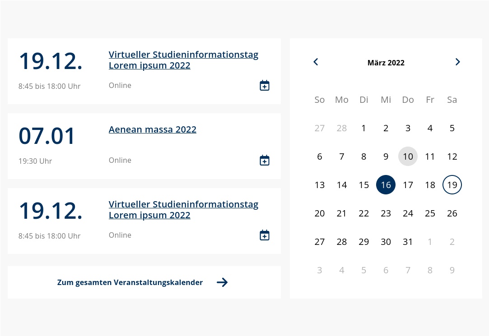

# TYPO3 Extension gb_events

Initially created from gute-botschafter.de
In2code took over the extension to commit future updates and TYPO3 compatability releases.
Markus Timtner provided the TYPO3 v12+ compatibility.

This extension is a calendar plugin with iCal export

Example output in frontend:

## Changelog

| Version | Date       | State         | Description                                                                                                                                            |
|---------|------------| ------------- |--------------------------------------------------------------------------------------------------------------------------------------------------------|
| 12.0.0  | 2025-02-16 | FEATURE       | TYPO3 v12+ update                                                                                                                                      |
| 11.0.1  | 2022-11-16 | BUGFIX        | Fix missing array keys exceptions in PHP 8                                                                                                             |
| 11.0.0  | 2022-11-11 | FEATURE       | Pass tt_content.* via {data} to all views, allow tt_content.layout, respect filter variables for one day                                               |
| 10.1.0  | 2022-11-09 | FEATURE       | Allow export controller also in plugin "Upcoming", fix some missing TCA labels                                                                         |
| 10.0.2  | 2022-10-10 | BUGFIX        | Fix "array to string" exception in PHP 8                                                                                                               |
| 10.0.1  | 2022-10-10 | BUGFIX        | Fix typo for TER releases                                                                                                                              |
| 10.0.0  | 2022-10-10 | FEATURE       | TYPO3 11 update                                                                                                                                        |
| 9.0.3   | 2022-01-14 | BUGFIX        | Add 404 handling for hidden and deleted records                                                                                                        |
| 9.0.2   | 2020-11-12 | BUGFIX        | Add missing controller to the event detail link on list views                                                                                          |
| 9.0.1   | 2020-11-09 | BUGFIX        | Show not appearing non-recurring events again                                                                                                          |
| 9.0.0   | 2020-11-06 | [!!!]FEATURE  | The archive shows now events from the past, the start and end time of an event is now available in the iCal download, add url_segment field for events |
| 8.0.0   | 2020-11-03 | [!!!]BUGFIX   | Drop TYPO3 6 and 7 support, Add TYPO3 9 support                                                                                                        |
| 7.0.1   | 2016-01-20 | BUGFIX        | Re-enable RTE for description field                                                                                                                    |
| 7.0.0   | 2016-01-07 | [!!!]BUGFIX   | TYPO3 7 support, Category support, archive plugin                                                                                                      |
